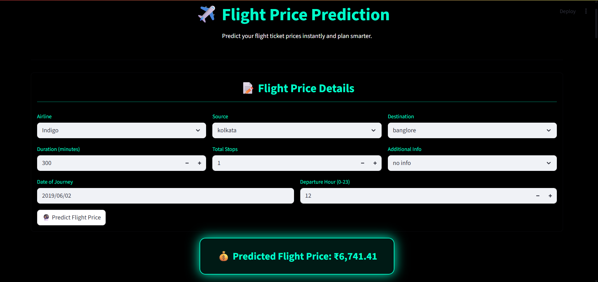

# AeroPrice Insight ✈️💰

This project provides an end-to-end solution for predicting flight ticket prices using machine learning. It features a complete pipeline including data preprocessing, feature engineering, model training (XGBoost), and a user-friendly interactive web application built with Streamlit.

The application not only predicts the price for a given flight configuration but also provides several actionable insights to help users find the best deals by exploring trade-offs like airline choice, departure time, travel dates, number of stops, and departure city.

[](https://www.youtube.com/watch?v=t00O_rV1O5I)
<br>*Click the image above to watch a video demonstration of the app.*

## ✨ Features

* **Accurate Price Prediction:** Enter flight details (airline, route, date, time, stops, duration) and get an instant price prediction.
* **Deal-o-Meter Gauge:** Instantly see if the predicted price is a "Great Deal," "Good Deal," "Average," or "Expensive" compared to historical prices for that specific route (if available).
* **Airline Comparison:** View predicted prices for the *same journey* across all available airlines, highlighting the user's selected airline.
* **Deeper Insights (via Tabs):**
    * **Price by Time:** See how the price changes for morning, afternoon, evening, or night departures.
    * **Flexible Dates:** Explore price trends using a line chart for a few days before and after your selected date.
    * **Price by Stops:** Compare the cost of non-stop vs. 1-stop or 2-stop flights for the same route and airline.
    * **Flexible Sources:** Check prices for flying *to* your chosen destination *from* different origin cities on the same day.
    * **Prediction Context:** Validate the prediction against historical data:
        * View similar flights on the *same route*, filterable by month.
        * View similar flights based on *duration* across *any route*.
* **Price Breakdown (SHAP Waterfall Plot):** Understand *why* the price is what it is by seeing how each feature contributed positively or negatively, starting from the average price.
* **Global Model Insights (SHAP Summary Plot):** See which factors (like duration, airline, stops) matter most for flight prices *overall*, demonstrating the model's logic.

## 🛠️ Technology Stack

* **Language:** Python 3
* **Data Science:** Pandas, NumPy, Scikit-learn, SciPy
* **Machine Learning:** XGBoost
* **Web Framework:** Streamlit
* **Visualization:** Plotly, Matplotlib, SHAP
* **Model Persistence:** Joblib

## 📂 Project Structure  

* **`artifacts/`** — Stores all machine learning artifacts.  
  * `column_transformer.joblib`: Saved preprocessing pipeline (encoding, scaling).  
  * **`models/`**
    * `randomforest_flight_price_model.joblib`: Trained Random Forest model.  
    * `xgb_flight_price_model.joblib`: Trained XGBoost regression model.  
* **`data/`** — Contains datasets used in the pipeline.  
  * `flight_price.csv`: Raw dataset.  
  * `cleaned_flight_data.csv`: Cleaned dataset after preprocessing.  
  * `train_data.csv`, `val_data.csv`, `test_data.csv`: Split datasets.  
* **`notebooks/`** — Jupyter notebooks for experimentation and development.  
  * `datapreprocessing.ipynb`: Data cleaning and preprocessing steps.  
  * `exploratory_data_analysis.ipynb`: Data visualization and trend analysis.  
  * `feature_engineering.ipynb`: Feature creation and transformation logic.  
  * `model_training_tuning.ipynb`: Training, tuning, and evaluation of models.  
  * `user_input.ipynb`: Simulated user input testing.  
* **`transformed_data/`** — Contains transformed datasets after pipeline application.  
  * `X_train_transformed.csv`  
  * `X_test_transformed.csv`  
* **`utils/`** — Reusable helper modules.  
  * `eda_helper_functions.py`: EDA visualization and summary utilities.  
  * `feature_utils.py`: Feature extraction and preprocessing functions.  
  * `rbf.py`: RBF-related transformations (if applicable).  
* **Main files:**  
  * `app.py`: Streamlit web application entry point.  
  * `freezed_new_flight_venv_requirements.txt`: Environment dependencies.  
  * `.gitignore`: Specifies untracked files.  
  * `README.md`: Project documentation (this file). 


## 🚀 Setup and Run

1.  **Clone the repository:**
    ```bash
    git clone [https://github.com/kartik23481/flight-price-prediction-app.git](https://github.com/kartik23481/flight-price-prediction-app.git)
    cd flight-price-prediction-app
    ```

2.  **Create a virtual environment (recommended):**
    ```bash
    python -m venv venv
    source venv/bin/activate  # On Windows use `venv\Scripts\activate`
    ```

3.  **Install dependencies:**
    ```bash
    pip install -r freezed_new_flight_venv_requirements.txt
    ```

4.  **Ensure Data and Artifacts:**
    Make sure the training data file (`data/train_data.csv`) and the saved model/transformer (`artifacts/`) are present in the correct locations.

5.  **Run the Streamlit app:**
    ```bash
    streamlit run app.py
    ```
    The application should open automatically in your web browser.

## 📈 Model Performance

The model performance was evaluated using two ensemble learning algorithms — **Random Forest** and **XGBoost** — trained independently to identify the most effective predictor for flight price estimation.  
Both models were validated on the same dataset (~6000 rows), with **XGBoost** demonstrating slightly superior results across all key metrics.

### 🧠 Model Comparison

| **Metric** | **Random Forest** | **XGBoost** |
|:------------|:----------------:|:------------:|
| **R² Score** | 0.85 | **0.86** |
| **RMSE** | 2524 | **2380** |
| **MAE** | 1750 | **1620** |

The **XGBoost regression model** achieves an **R² score of approximately 0.86** on the validation set, indicating a strong generalization capability and reliable performance for predicting flight prices based on engineered features.

---

### 💰 Error Distribution by Price Segment

| **Price Segment** | **Average Error (₹)** | **Percentage Error** |
|:------------------|:--------------------:|:-------------------:|
| **Budget (<5k)** | 445.63 | 11.53% |
| **Mid (5k–10k)** | 892.91 | 12.45% |
| **Upper-mid (10k–20k)** | 963.72 | 7.44% |
| **Premium (20k+)** | 6437.66 | 19.37% |

🔍 *Observation:*  
The model performs most consistently in the **upper-mid segment**, where flight price patterns are stable.  
Higher deviation in the **premium segment** is attributed to limited sample size and higher inherent price variability.

---

### 📊 Data Distribution

| **Price Range** | **Number of Rows** |
|:----------------|:-----------------:|
| Below ₹10,000 | 4,013 |
| ₹10,000 – ₹20,000 | 2,581 |
| Above ₹20,000 | 100 |

---

### 🧪 Validation Consistency

All results were **cross-verified using MOE-based consistency checks** to ensure reliability and minimize the risk of overfitting.  
This additional layer of statistical verification confirmed the model’s robustness across different flight segments and routes.


## 🔮 Future Improvements

* Modify the original model training script to correctly implement `get_feature_names_out` for custom transformers in the Scikit-learn pipeline. Re-save the `column_transformer.joblib` to enable user-friendly feature names in SHAP plots.
* Implement a complete **CI/CD Pipeline:** Set up automated testing (e.g., using GitHub Actions) and continuous deployment to a cloud platform.
* Integrate an **Interactive AI Chatbot:** Add an agentic AI chatbot (using Microsoft Autogen Framework) that allows users to ask natural language questions about the training data, generating insights and visualizations on the fly. 🤖📊
* Deploy the Streamlit app to a cloud platform (e.g., Streamlit Community Cloud, Heroku, AWS) for public access.
* Incorporate more recent or a larger dataset for potentially improved model accuracy and robustness.
* Experiment with alternative regression models (e.g., LightGBM, CatBoost) or further hyperparameter tuning.
* Add enhanced error handling for invalid user inputs (e.g., duration incompatible with stops, impossible routes).


## 👨‍💻 Author

**Kartik Srivastava**  
*AI & ML Enthusiast *  

🔗 [LinkedIn](https://www.linkedin.com/in/kartik-srivastava-462609285/)
